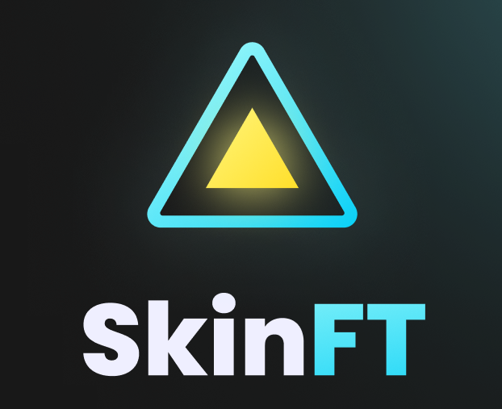

<p align="center">
    
</p>

##

<h4 align="center"> 
	🚧 SkinFT 🚧
</h4>

<p align="center">
     
    
</p>
    
## 💻 Sobre o projeto

💡 O maior marketplace de skins para CS:GO.

## 🎨 Design System

Feito por Igor Ferreira (https://www.behance.net/igorezn)

## 🛠 Tecnologias

As seguintes ferramentas foram utilizadas na construção do projeto:

- Node.js
- React
- React Native
- Prisma ORM
- Expo GO

## 🏁 Pré-requisitos

Antes de começar, é preciso ter instalado em sua máquina as seguintes ferramentas:

- NPM
- Node.js
- Git
- expo-cli
- Expo GO (app a ser instalado no dispositivo Android e/ou iOS)

## 🚀 Como executar o projeto

```bash
# Clone este repositório
$ git clone https://github.com/alexandrerehder/SkinFT

# Acesse a pasta do projeto no terminal/cmd
$ cd SkinFT/

# Suba os containers (mercadolivre, postgres, rabbitmq)
$ sudo make up
```

## 📕 Documentação do projeto

(...)
